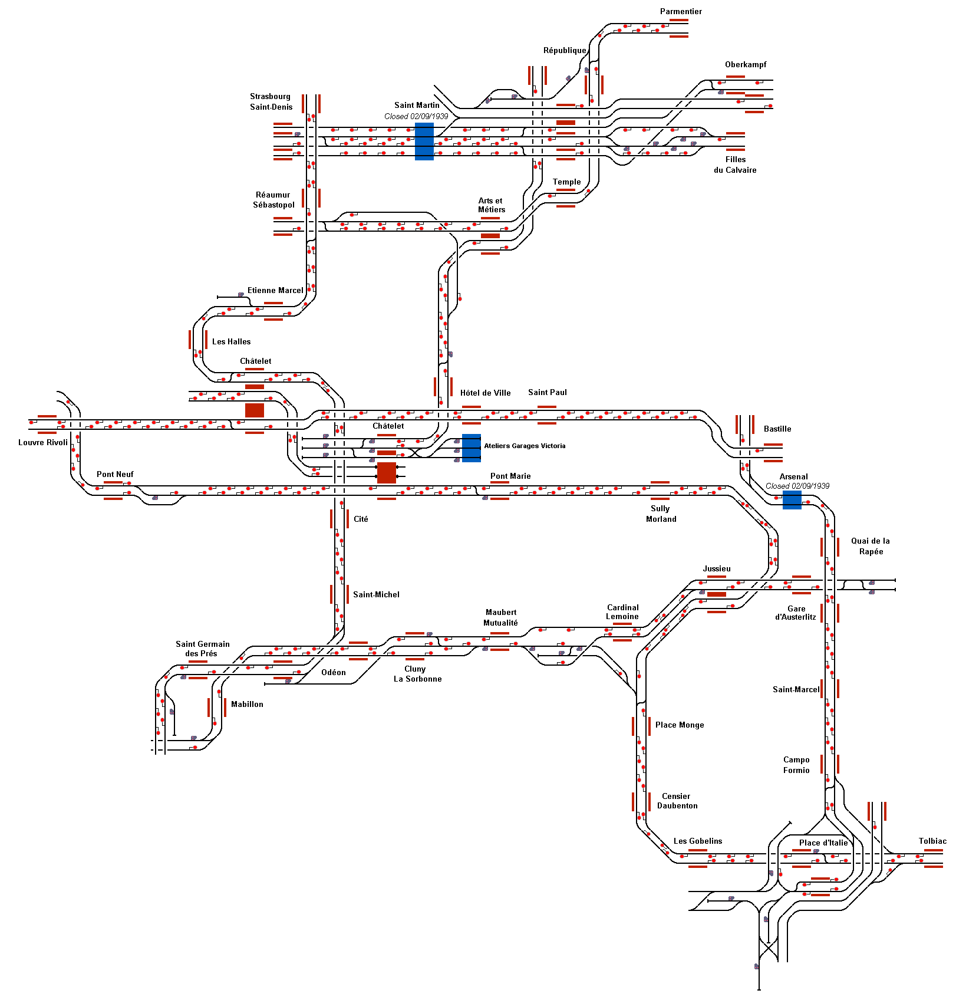

# Paris Métro, Paris, France
Representation of the Paris Metro connecting the suburbs of Paris with the city centre.

## Current Status

| Stage         | Status        |
| ------------- |:-------------:|
| Track Plan     | :heavy_check_mark: |
| Signalling      | :heavy_check_mark: |
| Naming | :heavy_check_mark: |
| Speed Limits | :heavy_check_mark: |
| Distances | :heavy_check_mark: |
| Timetable |  :heavy_check_mark: |
| Session |  :heavy_check_mark: |
| Documentation |  :heavy_check_mark: |

## Data Sources 

- [Carto Metro Paris Metro Map](http://carto.metro.free.fr/cartes/metro-paris/)

Status icons by Freepik, pixelmeetup, Pixel Perfect on FlatIcon.com.
